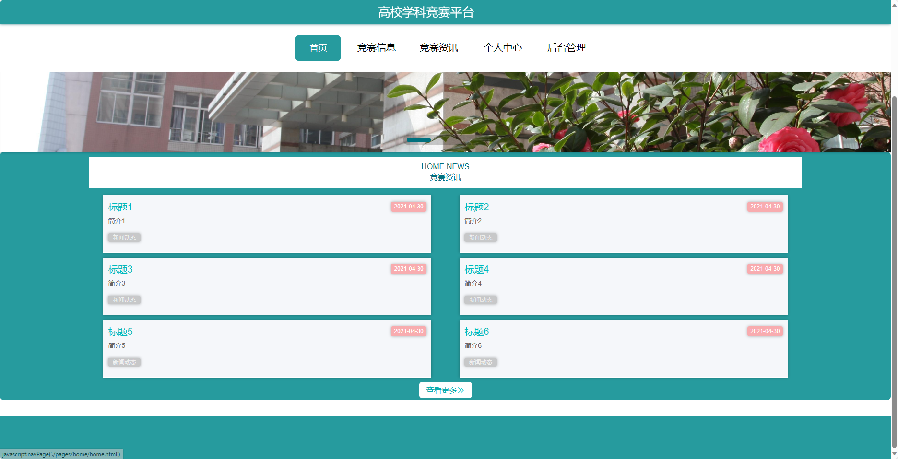
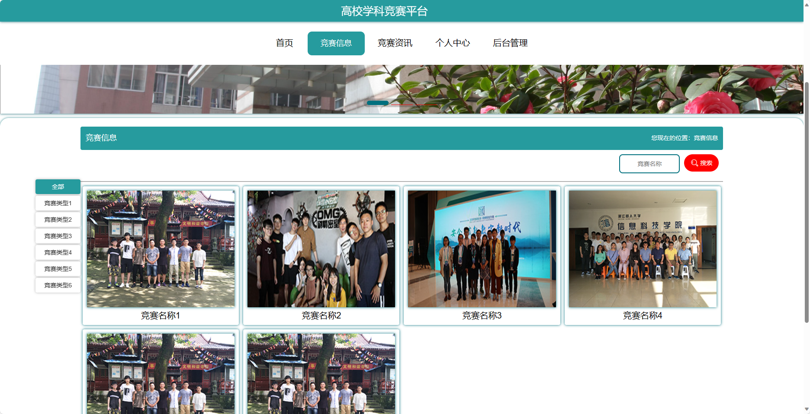
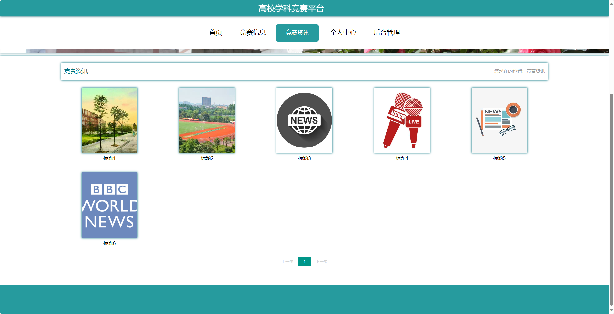
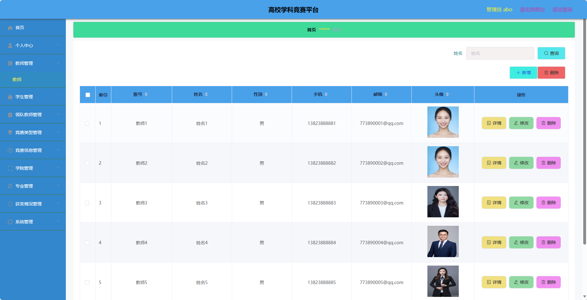
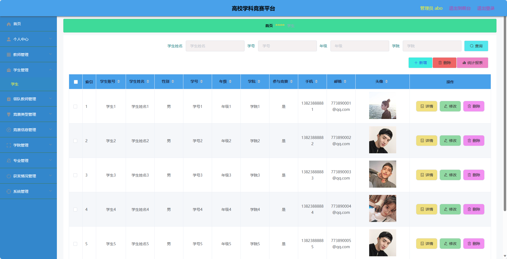
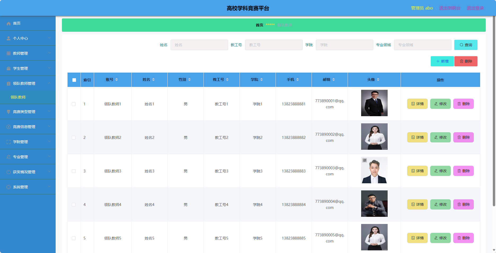
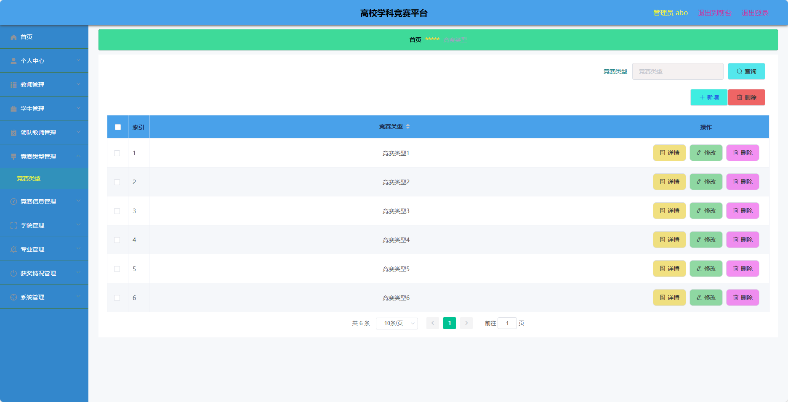

<h1 align="center">基于SpringBoot框架实现的高校学科竞赛平台【带文档】</h1>

 获取sql文件 QQ: 3645296857 QQ群: 978300347 

<h4> 需要视频演示可联系上述QQ，私发视频链接 </h4>

 获取更多高质量源码，请访问：[mzoo源码网](https://mzoocodes.com/)

## 简介

> 本代码来源于网络,仅供学习参考使用!
>
> <b style="color: dodgerblue"> 提供1.远程部署/2.修改代码/3.定制程序/4.文档指导/5.框架代码讲解、技术解答、代码讲解等服务 </b>
>
> 前台地址：http://localhost:8080/springboot46869/front/index.html
> 
> 后台地址：http://localhost:8080/springboot46869/admin/dist/index.html
>
> 管理员: admin 密码: 123456
> 
> 领队教师：领队教师1 密码：123456
> 
> 教师：教师1 密码：123456
> 
> 学生：学生1 密码：123456
>

## 项目介绍

基于SpringBoot框架实现的高校学科竞赛平台【带文档】：前端 vue、axios、elementui，后端 springboot、mybatis，系统角色分为：管理员、领对教师、教师和学生，管理员在管理后台用户信息、竞赛信息管理等；教师可以管理竞赛题库、管理参赛名单、获奖名单等；领队教师可以对竞赛资讯查看、报名等；学生可以查看参赛消息等。主要功能如下：

## 【前台】
### 学生 & 领队教师

- 首页：展示竞赛平台的基本信息和推荐竞赛活动。
- 竞赛信息：提供竞赛的详细信息。
- 竞赛资讯：发布最新的竞赛相关资讯和通知。
- 个人中心：用户可以查看和编辑个人信息，包括个人资料、报名记录等。

## 【后台】
### 管理员

- 个人中心：管理员可以管理自己的个人信息和权限。
- 教师管理：对教师信息进行管理，包括添加、修改和删除教师信息。
- 学生管理：对学生信息进行管理，包括添加、修改和删除学生信息。
- 领队教师管理：管理领队教师的信息，包括添加、修改和删除领队教师信息。
- 竞赛类型管理：管理竞赛的类型，包括添加、修改和删除竞赛类型。
- 竞赛信息管理：管理竞赛的详细信息，包括添加、修改和删除竞赛信息。
- 学院管理：管理学院的信息，包括添加、修改和删除学院信息。
- 专业管理：管理专业的信息，包括添加、修改和删除专业信息。
- 获奖情况管理：管理竞赛的获奖情况，包括添加、修改和删除获奖情况信息。
- 系统管理：管理系统的参数设置和日志记录。

### 教师

- 个人中心：教师可以查看和编辑个人信息。
- 题目类型管理：管理竞赛题目的类型，包括添加、修改和删除题目类型。
- 竞赛题库管理：管理竞赛题目的库，包括添加、修改和删除竞赛题目。
- 竞赛类型管理：管理竞赛的类型，包括添加、修改和删除竞赛类型。
- 竞赛信息管理：管理竞赛的详细信息，包括添加、修改和删除竞赛信息。
- 参赛申请管理：管理学生的参赛申请，包括审核和处理申请。
- 竞赛评分管理：对参赛作品进行评分。
- 参赛名单管理：管理参赛学生的名单，包括添加、修改和删除名单。
- 晋级名单管理：管理晋级学生的名单，包括添加、修改和删除名单。
- 获奖名单管理：管理获奖学生的名单，包括添加、修改和删除名单。
- 竞赛总结管理：学科竞赛活动总结的管理，包括撰写和发布总结。
- 报销清单管理：管理学生的报销清单，包括审核和处理报销。
- 成绩申诉管理：处理学生对成绩的申诉。
- 参赛信息管理：管理学生的参赛信息，包括添加、修改和删除参赛信息。
- 往年成绩管理：管理往年竞赛的成绩，包括添加、修改和删除成绩信息。
- 获奖情况管理：管理竞赛的获奖情况，包括添加、修改和删除获奖情况信息。

## 环境

- <b>IntelliJ IDEA 2020.3</b>

- <b>Mysql 5.7.26</b>

- <b>Maven 3.6.3</b>

- <b>JDK 1.8</b>

## 运行截图

